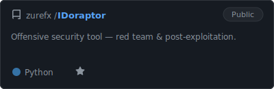
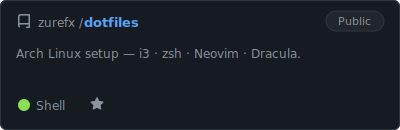
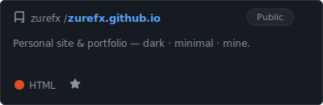

<h1 align="center">Hi 👋 I'm Genaro</h1>

  
  
  

---

<h2 align="left">Repo's 👽</h2>

  
  &nbsp;
  
    
  

---

<h2 align="left">Languages and Tools 🛠️</h2>

  
  
  
  
  

---

<h2 align="left">Environment 🖥️</h2>

  

---

<h2 align="left">My GitHub Data 🐱</h2>

  

---

<h2 align="left">Activity 🎯</h2>

